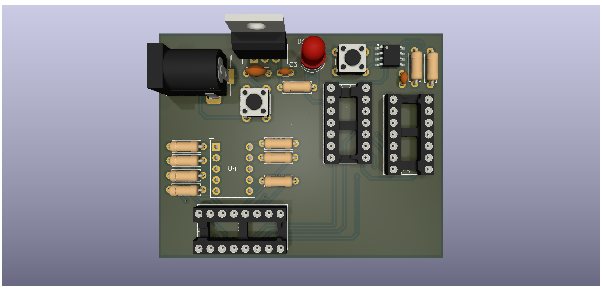

# Digital Dice - Electronic Random Number Generator

> A classic digital dice circuit using 555 timer and 7-segment display, showing random numbers 1-6



## 📋 Overview

This is an electronic dice circuit that generates random numbers from 1 to 6, displayed on a 7-segment display. When you press the button, the 555 timer oscillates at high frequency through a counter, creating a pseudo-random number generator. Releasing the button stops the counter and displays the result.

Perfect for learning digital electronics, logic circuits, and PCB design fundamentals!

## ✨ Features

- **True random generation** using 555 timer high-frequency oscillator
- **Single 7-segment display** shows numbers 1-6
- **Push-button operation** - press to roll, release to stop
- **Power indicator LED** 
- **Regulated 5V power supply** with LM7805
- **Classic TTL logic** using 74LS series ICs
- **Barrel jack input** for easy powering (7-12V DC)

## 🔧 Specifications

| Parameter | Value |
|-----------|-------|
| Input Voltage | 7-12V DC |
| Regulated Output | 5V (LM7805) |
| Display Type | Single 7-segment common cathode |
| Logic Family | 74LS TTL series |
| Power Consumption | ~50-100mA |
| Board Dimensions | TBD mm |
| PCB Layers | 2-layer |

## 🎯 How It Works

The circuit consists of 4 main sections:

### 1. **Power Supply**
- LM7805 voltage regulator converts 7-12V input to stable 5V
- Filtering capacitors for stable operation
- Barrel jack connector for power input

### 2. **Clock Generator (555 Timer)**
- NE555 configured as astable multivibrator
- High-frequency oscillation (~100kHz)
- R-C network sets timing (R10=100k, C4=0.01µF)

### 3. **Counter (74LS90)**
- Decade counter generates BCD outputs (0-9)
- Gates (74LS11) configure it to count 1-6 only
- Counts rapidly when button is pressed
- Stops at random number when button released

### 4. **Display Driver (74LS47 + 7-Segment)**
- 74LS47 BCD-to-7-segment decoder
- Drives SC39-11EWA common cathode display
- Current limiting resistors for LED segments

## 📐 PCB Design Details

- **Design Tool:** KiCad 9.0.2
- **Layers:** 2-layer FR4
- **Standard thickness:** 1.6mm recommended
- **Through-hole components** for easy hand assembly
- **IC sockets recommended** for 74LS and 555 ICs

## 🖼️ Images

### Schematic
See [docs/digital_dice.pdf](docs/digital_dice.pdf) for the complete schematic.

### PCB 3D Render


### Key Components Layout
- Bottom left: Power supply (barrel jack, LM7805, capacitors)
- Center: Logic ICs (555, 74LS90, 74LS47, 74LS11)
- Top right: Push buttons and LED indicator
- Right side: 7-segment display

## 📦 Repository Contents

```
├── README.md                    # This file
├── LICENSE                      # MIT License
├── .gitignore               
├── digital_dice.kicad_pro       # KiCad project file
├── digital_dice.kicad_sch       # Schematic
├── digital_dice.kicad_pcb       # PCB layout
├── gerbers/                     # Manufacturing files
│   ├── *.gbr                   # Gerber layers
│   ├── *.drl                   # Drill files
│   └── *.pos                   # Pick and place
├── docs/
│   ├── digital_dice.pdf        # Schematic PDF
│   └── BOM.csv                 # Bill of Materials
└── images/                      # Project images
    ├── board-3d.png
    ├── assembled.jpg
    └── demo.gif
```

## 🛠️ Bill of Materials (BOM)

### ICs
- **U1:** NE555D - Timer IC (DIP-8)
- **U2:** 74LS90 - Decade Counter (DIP-14)
- **U3:** 74LS47 - BCD to 7-Segment Decoder (DIP-16)
- **U4:** SC39-11EWA - 7-Segment Display, Common Cathode
- **U5:** LM7805 - 5V Voltage Regulator (TO-220)
- **U6:** 74LS11 - Triple 3-input AND Gate (DIP-14)

### Passive Components
- **R1, R2:** 10kΩ resistor (×2)
- **R5:** 220Ω resistor (for LED)
- **R10:** 100kΩ resistor
- **C3:** 0.1µF ceramic capacitor
- **C4:** 0.01µF ceramic capacitor
- **C5:** 0.33µF electrolytic capacitor

### Other Components
- **D1:** Red LED 5mm
- **SW1, SW2:** Tactile push buttons
- **J1:** DC Barrel Jack (2.1mm)
- **IC Sockets:** DIP-8, DIP-14, DIP-16 (recommended)

**Total component cost:** ~$5-10 USD

## 🔨 Assembly Instructions

1. **Solder IC sockets first** (recommended for easy troubleshooting)
2. **Add resistors and small capacitors**
3. **Install electrolytic capacitor** (watch polarity!)
4. **Mount voltage regulator** (LM7805) with heatsink if needed
5. **Add barrel jack and switches**
6. **Install LED** (long leg = anode, positive)
7. **Mount 7-segment display** last (verify pinout!)
8. **Insert ICs into sockets** (mind pin 1 orientation!)

### ⚠️ Important Notes:
- Double-check IC orientation before powering on
- Verify 5V output from regulator before inserting logic ICs
- Use IC sockets to prevent damage during soldering

## 🚀 Usage

1. **Power:** Connect 7-12V DC adapter to barrel jack (center positive)
2. **Check:** Power LED should light up
3. **Roll the dice:** Press and hold the button
4. **Get result:** Release button to see random number (1-6)

## 💡 Skills Demonstrated

- ✅ **Digital logic design** - counters, decoders, gates
- ✅ **Classic timer circuits** - 555 astable configuration
- ✅ **Power supply design** - voltage regulation, filtering
- ✅ **PCB layout** - through-hole component placement
- ✅ **Schematic capture** - proper labeling and organization
- ✅ **BCD and 7-segment display** interfacing
- ✅ **Documentation** - clear schematics and assembly guide

## 📚 Learning Resources

This project teaches fundamental concepts:
- 555 timer oscillator circuits
- Binary/BCD counting
- 7-segment display multiplexing
- TTL logic families
- PCB design workflow

Great for beginners in electronics and PCB design!

## 🔄 Future Improvements (v2.0 ideas)

- [ ] Add second 7-segment display for "double dice"
- [ ] Include piezo buzzer for sound effects
- [ ] Add "hold" function to freeze display
- [ ] SMD version for compact size
- [ ] Battery power option (9V battery clip)
- [ ] Automatic roll mode with timer

## 📝 License

This project is open source hardware licensed under the MIT License. 

Feel free to:
- Build your own
- Modify the design
- Learn from the schematics
- Use in educational projects

**Attribution appreciated but not required!**

## 👤 Author

**Vladyslav Hirchuk**  
GitHub: [@SoloScriptSage](https://github.com/SoloScriptSage)

---

*Built with KiCad 9.0.2 | Rev 1.0 | November 2025*

If you build this project, I'd love to see it! Feel free to open an issue with photos of your build.
