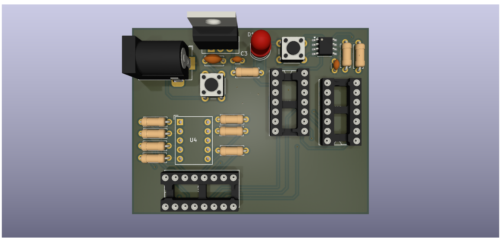

# 🎲 Digital Dice

A hardware random number generator built entirely from discrete logic ICs — no microcontroller, no code. Press the button, get a random number from 1 to 6 on a 7-segment display.



---

## How It Works

The circuit is split into four sections:

```
[Power Supply] → [555 Timer Oscillator] → [74LS90 Counter] → [74LS47 BCD Decoder] → [7-Segment Display]
```

**1. Power Supply (LM7805)**
Accepts any DC input (7–35V via barrel jack) and regulates it down to a stable 5V. Decoupling capacitors filter noise on the supply line.

**2. Clock Generator (NE555 in astable mode)**
The 555 timer oscillates continuously, generating a fast clock signal. While the button is not pressed, the counter increments at high speed — too fast for the eye to track, which creates the randomness.

**3. Counter / Random Number Generator (74LS90)**
A 4-bit BCD counter that cycles 0→9. A NAND gate feedback loop (74LS11) resets it at 6, so it only counts 0–5 (displayed as 1–6). When the button is released, the counter freezes at whatever value it landed on.

**4. BCD Decoder + Display (74LS47 + SC39-11EWA)**
The 74LS47 converts the binary counter output into the 7 segment drive signals. A 220Ω current-limiting resistor protects the display segments.

---

## Components

| Component | Part | Purpose |
|-----------|------|---------|
| U1 | NE555D | Astable oscillator (clock) |
| U2 | 74LS90 | 4-bit BCD counter |
| U3 | 74LS47 | BCD to 7-segment decoder |
| U4 | SC39-11EWA | Common cathode 7-segment display |
| U5 | LM7805 | 5V linear voltage regulator |
| U6A/D | 74LS11 | Triple 3-input AND gate (reset logic) |
| SW1 | SPST | Roll button |
| SW2 | SPST | Power switch |
| R1 | 10kΩ | 555 timing resistor |
| R5 | 220Ω | Display current limiter |
| R10 | 100kΩ | 555 timing resistor |
| J1 | Barrel Jack | DC power input |

---

## Schematic

Designed in **KiCad 9.0.2**. Full schematic and PCB layout files included in the repository.

---

## What I Learned

- Astable 555 timer configuration and RC timing calculations
- 4-bit BCD counter operation and modulo-N reset using gate feedback
- BCD to 7-segment decoding without a microcontroller
- PCB layout for mixed digital/analog circuits in KiCad

---

## Author

**Vladyslav Hirchuk** — [GitHub](https://github.com/SoloScriptSage) · [LinkedIn](https://linkedin.com/in/vladyslavhirchuk)
